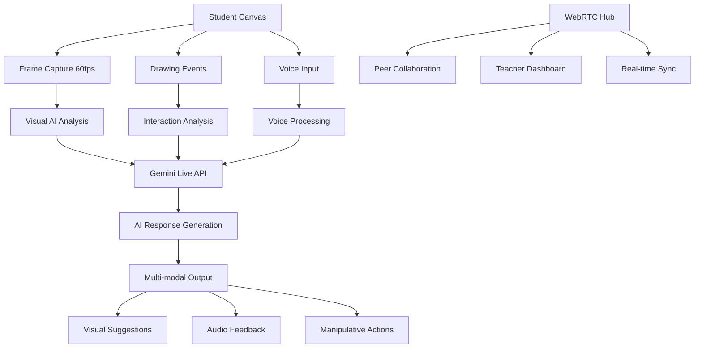

# AI Streaming Architecture for Simili

## Overview
This document outlines the real-time AI streaming architecture designed for educational applications, specifically optimized for future Gemini Live 2.0 integration with WebRTC collaboration.

## 🏗️ Half-Cascade Architecture

The half-cascade architecture processes different data streams at different frequencies to optimize performance and educational effectiveness:

### Stream Hierarchy

```
📊 AI STREAMING PIPELINE
├── High Frequency (60fps) - Visual Stream
│   ├── Canvas frame capture
│   ├── Drawing gesture recognition  
│   ├── Real-time shape detection
│   └── Immediate visual feedback
│
├── Medium Frequency (10fps) - Interaction Stream
│   ├── Manipulative state changes
│   ├── Tool usage patterns
│   ├── Collaboration events
│   └── Learning analytics
│
├── Low Frequency (1fps) - Context Stream  
│   ├── Educational assessment
│   ├── Learning objective progress
│   ├── Student engagement analysis
│   └── Curriculum alignment
│
└── Event-Driven - Immediate Stream
    ├── Voice commands
    ├── Error corrections
    ├── Help requests
    └── Critical interventions
```

## 🎯 Educational AI Integration Points

### 1. Canvas Streaming to Gemini Live
```typescript
interface CanvasToAI {
  frameData: ImageData          // Visual canvas state
  metadata: {
    drawingEvents: Event[]      // Recent drawing actions
    manipulatives: Object[]     // Active math tools
    annotations: Annotation[]   // Teacher/AI annotations
  }
  educationalContext: {
    gradeLevel: number
    subject: string
    learningObjectives: string[]
    currentActivity: ActivityType
  }
}
```

### 2. Audio Pipeline
```typescript
interface AudioPipeline {
  studentVoice: MediaStream     // Student speech
  teacherVoice: MediaStream     // Teacher guidance  
  aiVoice: MediaStream          // Gemini Live responses
  ambientAudio: MediaStream     // Classroom environment
  voiceCommands: VoiceCommand[] // Parsed commands
  speechToText: string[]        // Transcribed conversations
}
```

### 3. Real-time Collaboration
```typescript
interface CollaborationSync {
  peers: PeerConnection[]       // Student-to-student
  teacher: TeacherConnection    // Teacher oversight
  aiTutor: AIConnection         // Gemini Live tutor
  sharedState: {
    canvas: CanvasState
    manipulatives: Tool[]
    annotations: Annotation[]
    voiceChat: AudioChannel[]
  }
}
```

## 🚀 WebRTC + Gemini Live Integration

### Architecture Flow


### Data Compression Strategy
```typescript
// Optimized for educational bandwidth
const compressionLevels = {
  visualStream: {
    fps: 60,
    quality: 0.7,        // Balance quality/bandwidth
    deltaEncoding: true,  // Only send changes
    regionOfInterest: true // Focus on active drawing area
  },
  audioStream: {
    sampleRate: 16000,   // Sufficient for speech
    channels: 1,         // Mono for efficiency  
    compression: 'opus', // WebRTC standard
    echoCancellation: true
  },
  metadataStream: {
    format: 'msgpack',   // Efficient binary format
    batching: true,      // Group related events
    priority: 'high'     // Critical for learning
  }
}
```

## 🧠 Educational AI Processing

### Learning State Machine
```typescript
enum LearningState {
  EXPLORING = 'exploring',     // Initial discovery
  PRACTICING = 'practicing',   // Skill building
  STRUGGLING = 'struggling',   // Needs intervention
  MASTERING = 'mastering',     // Advanced understanding
  TEACHING = 'teaching'        // Peer explanation
}

interface StudentModel {
  currentState: LearningState
  conceptMastery: Map<string, number>
  preferredLearningStyle: 'visual' | 'auditory' | 'kinesthetic'
  attentionLevel: number
  collaborationStyle: 'leader' | 'follower' | 'independent'
}
```

### AI Response Types
```typescript
interface AIResponse {
  type: 'suggestion' | 'encouragement' | 'question' | 'explanation' | 'intervention'
  timing: 'immediate' | 'delayed' | 'on-pause' | 'end-of-session'
  modality: 'voice' | 'visual' | 'manipulative' | 'combined'
  content: {
    text: string
    audio?: ArrayBuffer
    visualCues?: VisualHint[]
    manipulativeActions?: ToolAction[]
  }
  educationalRationale: string
  confidence: number
}
```

## 🔧 Implementation Phases

### Phase 1: Local AI Processing (Current)
- ✅ Canvas streaming pipeline
- ✅ WebRTC peer connections
- ✅ Basic shape recognition
- ✅ Voice command processing
- ✅ Session persistence

### Phase 2: Gemini Live Integration (Next)
- 🔄 WebSocket connection to Gemini Live API
- 🔄 Multi-modal streaming (audio + visual)
- 🔄 Educational context injection
- 🔄 Real-time AI responses
- 🔄 Advanced learning analytics

### Phase 3: Advanced Collaboration (Future)
- ⏳ Multi-classroom connections
- ⏳ Teacher dashboard integration
- ⏳ Parent progress sharing
- ⏳ Curriculum alignment
- ⏳ Assessment automation

## 📊 Performance Optimization

### Bandwidth Management
```typescript
const adaptiveBitrate = {
  excellent: { visual: '2mbps', audio: '128kbps' },
  good: { visual: '1mbps', audio: '64kbps' },
  poor: { visual: '500kbps', audio: '32kbps' },
  minimal: { visual: '250kbps', audio: '16kbps' }
}

function adjustQuality(networkCondition: NetworkQuality) {
  const settings = adaptiveBitrate[networkCondition]
  updateStreamQuality(settings)
  notifyGeminiLive({ qualityAdjustment: settings })
}
```

### Memory Management
```typescript
const bufferLimits = {
  visualFrames: 30,      // 0.5 seconds at 60fps
  interactionEvents: 100, // Recent interactions
  aiResponses: 50,       // AI conversation history
  audioBuffers: 10       // 10 second rolling buffer
}
```

## 🔒 Privacy & Security

### Data Handling
- **Local Processing**: Sensitive student data processed locally when possible
- **Encrypted Streams**: All WebRTC connections use DTLS encryption
- **Consent Management**: Clear opt-in for AI analysis and recording
- **Data Retention**: Configurable retention policies for educational data
- **COPPA Compliance**: Age-appropriate data handling for children

### Gemini Live Integration Security
```typescript
const securityConfig = {
  authentication: 'OAuth2 + JWT',
  encryption: 'TLS 1.3',
  dataAnonymization: true,
  regionalCompliance: ['GDPR', 'COPPA', 'FERPA'],
  auditLogging: 'comprehensive'
}
```

## 🎮 User Experience Design

### Ambient AI Presence
- **Non-intrusive**: AI suggestions appear contextually
- **Child-friendly**: Age-appropriate language and interactions
- **Confidence building**: Positive reinforcement and encouragement
- **Adaptive**: Adjusts to individual learning pace and style

### Collaborative Features
- **Seamless sharing**: One-click workspace sharing
- **Real-time sync**: Instant drawing and manipulative updates
- **Voice communication**: Natural conversation between peers
- **Teacher oversight**: Optional teacher monitoring and guidance

## 📋 Development Checklist

### Core Infrastructure
- [x] WebRTC manager implementation
- [x] Canvas streaming pipeline
- [x] Audio processing setup
- [x] Session management
- [x] Collaborative sharing

### AI Integration
- [x] Local AI processing framework
- [x] Educational context modeling
- [x] Response generation system
- [ ] Gemini Live API integration
- [ ] Multi-modal response handling

### Educational Features
- [x] Learning state tracking
- [x] Progress analytics
- [x] Manipulative interactions
- [ ] Curriculum alignment
- [ ] Assessment automation

### Production Readiness
- [ ] Load testing
- [ ] Security audit
- [ ] Accessibility compliance
- [ ] Performance optimization
- [ ] Documentation completion

---

This architecture provides a solid foundation for real-time educational AI that can scale from individual learning to classroom collaboration, with Gemini Live 2.0 as the intelligent backbone for personalized tutoring.
