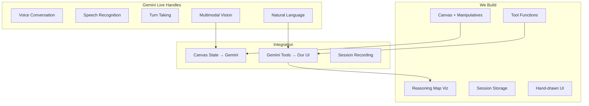

# Product Requirements Document
# Simili Math Tutor - Reasoning Visualization Platform

**Version:** 3.0  
**Date:** January 2025  
**Status:** Development Ready  
**Architecture:** Gemini Live 2.0 Multimodal  
**Design System:** Hand-drawn UI (rough.js)

---

## 1. Executive Summary

### 1.1 Product Vision
Simili is a reasoning visualization platform that makes student mathematical thinking visible. Using Gemini Live's multimodal conversational AI as the tutoring layer, we focus on capturing, structuring, and visualizing the student's problem-solving journey through an engaging, hand-drawn interface that feels approachable and mistake-friendly.

### 1.2 Core Innovation
**What We Build:** The reasoning map visualization system, hand-drawn manipulatives, and domain-specific mathematical tools.  
**What Gemini Provides:** All voice interaction, conversation flow, multimodal understanding, and natural tutoring behavior.

### 1.3 Design Philosophy
Using rough.js and hand-drawn aesthetics to:
- Reduce math anxiety (feels like sketching, not testing)
- Encourage experimentation (mistakes look intentional)
- Match how kids actually work (messy is okay)
- Create warmth and approachability

### 1.4 Success Criteria
- Students engage in mathematical discourse for >45 seconds per problem
- 70% of students attempt multiple solution strategies
- Reasoning maps accurately capture student thinking journey
- Teachers report improved visibility into student understanding

---

## 2. Technical Architecture

### 2.1 System Overview



### 2.2 Gemini Live Configuration

```typescript
// Gemini Live Setup
const geminiConfig = {
  model: "gemini-2.0-flash-exp",
  voice: {
    style: "friendly_patient",
    speed: 0.95, // Slightly slower for kids
    pitch: 1.1   // Slightly higher, warmer
  },
  
  systemInstruction: `
    You are Pi, a friendly math tutor for elementary students.
    
    PERSONALITY:
    - Warm, patient, encouraging
    - Celebrate mistakes as learning opportunities
    - Use grade-appropriate language
    - Never give direct answers, only Socratic guidance
    
    BEHAVIOR:
    - When student explains reasoning, call mark_reasoning_step
    - When detecting misconception, call flag_misconception
    - When student is stuck for 30s, call suggest_hint
    - When student erases repeatedly, call celebrate_exploration
    
    CRITICAL: Let students think. Don't interrupt productive struggle.
    Only intervene when truly stuck or explicitly asked for help.
  `,
  
  tools: [
    {
      name: "mark_reasoning_step",
      description: "Record a step in student's reasoning",
      parameters: {
        transcript: "string",
        classification: "correct | partial | incorrect | exploring",
        concepts: "string[]",
        confidence: "number"
      }
    },
    {
      name: "flag_misconception",
      description: "Identify a mathematical misconception",
      parameters: {
        type: "unequal_parts | counting_not_measuring | whole_unclear",
        evidence: "string",
        severity: "minor | major"
      }
    },
    {
      name: "suggest_hint",
      description: "Provide scaffolded support",
      parameters: {
        level: "encouragement | question | visual_hint | worked_example",
        content: "string"
      }
    },
    {
      name: "celebrate_exploration",
      description: "Acknowledge productive struggle",
      parameters: {
        message: "string",
        animation: "sparkle | grow | bounce"
      }
    },
    {
      name: "annotate_canvas",
      description: "Draw on student's canvas",
      parameters: {
        type: "arrow | circle | underline",
        coordinates: "Point[]",
        color: "string",
        message: "string"
      }
    }
  ]
}
```

### 2.3 Hand-Drawn UI System

```typescript
// rough.js Configuration for Warm, Approachable UI
import rough from 'roughjs/bundled/rough.esm.js'

const uiConfig = {
  roughness: 1.5,        // Hand-drawn feel
  bowing: 1,             // Slight curve to lines
  strokeWidth: 2,        // Chunky, kid-friendly
  fillStyle: 'hachure',  // Sketchy fill
  fillWeight: 1,
  hachureAngle: -41,     // Consistent sketch angle
  hachureGap: 4,
  
  colors: {
    primary: '#4F46E5',      // Indigo
    correct: '#10B981',      // Green
    incorrect: '#F59E0B',    // Amber (not red!)
    exploring: '#8B5CF6',    // Purple
    background: '#FFFEF7',   // Warm paper
    ink: '#1F2937'          // Soft black
  }
}

// Components with hand-drawn aesthetic
const HandDrawnComponents = {
  // Reasoning step bubbles
  ReasoningBubble: ({ step, classification }) => {
    const rc = rough.svg(svg)
    return rc.rectangle(x, y, width, height, {
      fill: colors[classification],
      fillStyle: 'solid',
      roughness: 1.5,
      bowing: 2
    })
  },
  
  // Math manipulatives
  FractionBar: ({ parts, filled }) => {
    const rc = rough.canvas(canvas)
    // Main rectangle
    rc.rectangle(x, y, width, height, {
      roughness: 1.2,
      fill: 'transparent'
    })
    // Dividing lines (wonky on purpose)
    for (let i = 1; i < parts; i++) {
      rc.line(
        x + (width/parts * i), 
        y - 2, 
        x + (width/parts * i), 
        y + height + 2,
        { roughness: 1.5, bowing: 0.5 }
      )
    }
  },
  
  // Pizza visual
  Pizza: ({ slices = 8 }) => {
    const rc = rough.canvas(canvas)
    // Rough circle for pizza
    rc.circle(cx, cy, diameter, {
      fill: '#FFA500',
      fillStyle: 'solid',
      roughness: 1.8
    })
    // Pepperoni with hand-drawn circles
    pepperoniPositions.forEach(pos => {
      rc.circle(pos.x, pos.y, 20, {
        fill: '#8B0000',
        fillStyle: 'solid',
        roughness: 1
      })
    })
  }
}
```

---

## 3. Core Features Implementation

### 3.1 Reasoning Map Visualization

```typescript
interface ReasoningMap {
  // Visual representation of thinking journey
  display: 'timeline' | 'tree' | 'constellation'
  
  // Each step captured by Gemini's tool calls
  steps: Array<{
    id: string
    timestamp: number
    transcript: string  // What student said
    classification: 'correct' | 'partial' | 'incorrect' | 'exploring'
    visual: {
      bubble: RoughSVGElement  // Hand-drawn bubble
      connector: RoughSVGElement // Sketchy line to next step
      animation: 'draw-in' | 'pulse' | 'celebrate'
    }
    canvasSnapshot: string
    concepts: MathConcept[]
  }>
  
  // Branching for multiple strategies
  branches: Array<{
    fromStep: string
    toStep: string
    type: 'alternative' | 'revision' | 'backtrack'
  }>
  
  // Celebrations for productive struggle
  celebrations: Array<{
    stepId: string
    type: 'mistake_learning' | 'persistence' | 'creativity'
    animation: RoughAnimation
  }>
}

// Rendering with rough.js
class ReasoningMapRenderer {
  renderStep(step: ReasoningStep) {
    const rc = rough.svg(this.svg)
    
    // Draw thought bubble with hand-drawn feel
    const bubble = rc.ellipse(
      step.x, step.y, 
      step.width, step.height,
      {
        fill: this.getColorForClassification(step.classification),
        fillStyle: 'solid',
        fillWeight: 0.5,
        roughness: 1.5,
        bowing: 2
      }
    )
    
    // Add sketchy connector to next step
    if (step.next) {
      const connector = rc.curve(
        step.points,
        {
          roughness: 1.2,
          strokeWidth: 2,
          stroke: '#6B7280'
        }
      )
    }
    
    // Celebration animation for mistakes
    if (step.classification === 'incorrect') {
      this.celebrateMistake(step)
    }
  }
  
  celebrateMistake(step) {
    // Growing flower animation around mistake
    const flower = rc.circle(step.x, step.y, 0, {
      stroke: '#F59E0B',
      strokeWidth: 3,
      roughness: 2
    })
    
    // Animate growth
    anime({
      targets: flower,
      r: [0, 30],
      opacity: [1, 0],
      duration: 1000,
      easing: 'easeOutElastic'
    })
  }
}
```

### 3.2 Interactive Canvas with Manipulatives

```typescript
class SimiliCanvas {
  constructor() {
    this.tldraw = new Tldraw({
      // Custom tools with hand-drawn rendering
      tools: [
        HandDrawnPenTool,
        FractionBarTool,
        NumberLineTool,
        DividerTool
      ],
      
      // Override default rendering with rough.js
      shapeUtils: {
        renderShape: (shape) => {
          return this.renderWithRough(shape)
        }
      },
      
      // Warm paper background
      background: '#FFFEF7'
    })
    
    // Send canvas state to Gemini on change
    this.tldraw.on('change', debounce((state) => {
      this.sendCanvasContext(state)
    }, 500))
  }
  
  async sendCanvasContext(state) {
    // Convert canvas to image for Gemini's vision
    const snapshot = await this.tldraw.getSnapshot()
    
    // Send to Gemini Live
    await geminiLive.sendImage(snapshot, {
      context: "Student's current work on the problem"
    })
  }
  
  renderWithRough(shape) {
    const rc = rough.canvas(this.canvas)
    
    switch(shape.type) {
      case 'pen':
        // Student's drawing with sketchy line
        rc.path(shape.points, {
          roughness: 0.8,
          strokeWidth: 3,
          stroke: shape.color
        })
        break
        
      case 'fraction_bar':
        // Hand-drawn fraction representation
        this.drawFractionBar(rc, shape)
        break
        
      case 'pi_annotation':
        // Pi's hints in different color/style
        rc.path(shape.points, {
          roughness: 1.5,
          strokeWidth: 2,
          stroke: '#4F46E5',
          strokeLineDash: [5, 5]
        })
        break
    }
  }
}
```

### 3.3 Session Recording & Replay

```typescript
class SessionRecorder {
  private events: SessionEvent[] = []
  
  constructor(private geminiLive: GeminiLive) {
    // Record all Gemini tool calls
    geminiLive.on('tool_called', (tool, params) => {
      this.events.push({
        type: 'tool_call',
        timestamp: Date.now(),
        tool,
        params
      })
    })
    
    // Record canvas changes
    canvas.on('change', (state) => {
      this.events.push({
        type: 'canvas_change',
        timestamp: Date.now(),
        state
      })
    })
    
    // Record audio (optional, for replay)
    geminiLive.on('audio_chunk', (chunk) => {
      this.events.push({
        type: 'audio',
        timestamp: Date.now(),
        chunk
      })
    })
  }
  
  async replay(speed = 1) {
    // Replay events in sequence
    for (const event of this.events) {
      switch(event.type) {
        case 'tool_call':
          // Replay reasoning step appearing
          this.replayToolCall(event)
          break
          
        case 'canvas_change':
          // Replay canvas drawing
          this.replayCanvasChange(event)
          break
          
        case 'audio':
          // Replay conversation (optional)
          this.replayAudio(event)
          break
      }
      
      // Wait based on timestamp difference
      await this.wait(event.nextDelay / speed)
    }
  }
}
```

---

## 4. Development Phases (Simplified)

### 4.1 Phase v0: Core Loop (3 weeks)

#### Week 1: Gemini Live Integration + Hand-drawn UI
```typescript
Sprint 0.1: Foundation
□ Next.js project with TypeScript
□ Gemini Live 2.0 integration
□ rough.js setup for UI components
□ Hand-drawn button, panel, bubble components
□ Pi personality configuration
□ Single pizza fraction problem

Deliverable: Can have math conversation with Pi
Test: Voice interaction works, UI feels approachable
```

#### Week 2: Canvas + Tool Integration
```typescript
Sprint 0.2: Multimodal Integration
□ tldraw canvas with rough.js rendering
□ Fraction bar manipulative (hand-drawn)
□ Pizza visual with rough.js
□ Send canvas snapshots to Gemini
□ Implement tool functions for reasoning capture
□ Basic reasoning step display

Deliverable: Gemini can see and comment on canvas
Test: Tool calls trigger UI updates correctly
```

#### Week 3: Reasoning Map MVP
```typescript
Sprint 0.3: Visualization
□ Reasoning map with hand-drawn bubbles
□ Connect Gemini tool calls to map
□ Step classification visualization
□ Mistake celebration animations
□ Session recording to localStorage
□ Basic replay functionality

Deliverable: Complete problem with reasoning map
Test: 5 students complete pizza problem, map captures journey
```

### 4.2 Phase v1: Enhanced Intelligence (4 weeks)

#### Week 4-5: Problem Variety & Progression
```typescript
Sprint 1.1: Content Expansion
□ 5 problems for Grade 3 fractions unit
□ Problem progression logic
□ More manipulatives (number line, arrays)
□ Hand-drawn problem illustrations
□ Session persistence across problems

Deliverable: Complete fraction unit
Test: Students progress through 3+ problems
```

#### Week 6-7: Advanced Reasoning Features
```typescript
Sprint 1.2: Reasoning Enhancement
□ Branching visualization for strategies
□ Concept tagging and clustering
□ Misconception pattern detection
□ Enhanced replay with audio sync
□ Export reasoning map as image

Deliverable: Rich reasoning visualization
Test: Teachers understand student thinking from map
```

### 4.3 Phase v2: Teacher Tools (4 weeks)

#### Week 8-11: Teacher Dashboard
```typescript
Sprint 2.1: Teacher Features
□ Class overview of reasoning maps
□ Common misconception identification
□ Student grouping suggestions
□ Progress tracking
□ Parent report generation

Deliverable: Teacher dashboard
Test: Teachers can identify intervention needs
```

---

## 5. Technical Stack

```yaml
Frontend:
  Framework: Next.js 14 (App Router)
  Language: TypeScript 5.x
  Canvas: tldraw 2.x
  Hand-drawn UI: rough.js 4.x
  Animation: Framer Motion
  State: Zustand
  Styling: Tailwind CSS + Custom rough.js components

AI/ML:
  Conversational AI: Gemini Live 2.0
  Vision: Gemini Multimodal
  Tools: Custom TypeScript functions
  
Backend:
  Database: Supabase (PostgreSQL)
  Storage: Cloudflare R2
  Hosting: Vercel
  
Development:
  Testing: Vitest + Playwright
  CI/CD: GitHub Actions
```

---

## 6. UI/UX Design System

### 6.1 Hand-Drawn Component Library

```typescript
// Design tokens for rough.js
const designSystem = {
  // Roughness levels
  roughness: {
    subtle: 0.5,    // Nearly straight
    normal: 1.5,    // Clearly hand-drawn
    playful: 2.5    // Very sketchy
  },
  
  // Color palette (warm, friendly)
  colors: {
    paper: '#FFFEF7',        // Warm white
    ink: '#2D3748',          // Soft black
    primary: '#5B21B6',      // Purple
    success: '#059669',      // Green
    warning: '#D97706',      // Amber
    error: '#DC2626',        // Red (used sparingly)
    
    // Pastel fills for bubbles
    fills: {
      correct: '#D1FAE5',    // Light green
      partial: '#FEF3C7',    // Light yellow
      incorrect: '#FED7AA',  // Light orange
      exploring: '#E9D5FF'   // Light purple
    }
  },
  
  // Animation presets
  animations: {
    drawIn: {
      strokeDasharray: 1000,
      strokeDashoffset: [1000, 0],
      duration: 1000
    },
    pulse: {
      scale: [1, 1.05, 1],
      duration: 500
    },
    celebrate: {
      rotate: [-5, 5, -5],
      scale: [1, 1.1, 1],
      duration: 300
    }
  }
}
```

### 6.2 Component Examples

```typescript
// Hand-drawn button
const SketchyButton = ({ children, onClick }) => {
  const [isHovered, setIsHovered] = useState(false)
  
  return (
    <button
      onMouseEnter={() => setIsHovered(true)}
      onMouseLeave={() => setIsHovered(false)}
      onClick={onClick}
      className="relative"
    >
      <svg>
        {rough.rectangle(0, 0, width, height, {
          fill: isHovered ? colors.primary : 'transparent',
          fillStyle: isHovered ? 'solid' : 'hachure',
          roughness: 1.5,
          bowing: isHovered ? 2 : 1
        })}
      </svg>
      <span className="absolute inset-0 flex items-center justify-center">
        {children}
      </span>
    </button>
  )
}

// Hand-drawn progress indicator
const SketchyProgress = ({ steps, current }) => {
  return (
    <svg>
      {steps.map((step, i) => {
        const isComplete = i < current
        const isCurrent = i === current
        
        return rough.circle(x + i * spacing, y, radius, {
          fill: isComplete ? colors.success : 'transparent',
          fillStyle: isComplete ? 'solid' : 'hachure',
          roughness: isCurrent ? 2 : 1,
          strokeWidth: isCurrent ? 3 : 2
        })
      })}
    </svg>
  )
}
```

---

## 7. Implementation Details

### 7.1 Tool Functions for Gemini

```typescript
// These are called by Gemini Live during conversation
const toolImplementations = {
  mark_reasoning_step: async (params) => {
    // Add to reasoning map
    const step = {
      id: generateId(),
      timestamp: Date.now(),
      transcript: params.transcript,
      classification: params.classification,
      concepts: params.concepts,
      confidence: params.confidence
    }
    
    // Update UI with hand-drawn bubble
    reasoningMap.addStep(step)
    
    // Animate appearance
    animateStepAppearance(step)
    
    // Store in session
    session.addReasoningStep(step)
    
    return { success: true }
  },
  
  flag_misconception: async (params) => {
    // Highlight misconception visually
    const visual = createMisconceptionVisual(params)
    
    // Don't show as "error" - show as "interesting thinking"
    reasoningMap.addAnnotation({
      type: 'misconception',
      visual: visual,
      celebration: true  // Celebrate the attempt!
    })
    
    return { success: true }
  },
  
  suggest_hint: async (params) => {
    // Visual hint appears on canvas
    if (params.level === 'visual_hint') {
      canvas.addPiAnnotation({
        type: params.hintType,
        coordinates: params.coordinates,
        style: 'hand-drawn',
        color: colors.primary
      })
    }
    
    return { success: true }
  },
  
  celebrate_exploration: async (params) => {
    // Trigger celebration animation
    const animation = celebrations[params.animation]
    reasoningMap.celebrate(animation)
    
    // Add encouragement to transcript
    transcript.addEncouragement(params.message)
    
    return { success: true }
  }
}
```

### 7.2 Session Data Model

```typescript
interface Session {
  id: string
  studentId: string
  problemId: string
  startTime: Date
  
  // Captured from Gemini tool calls
  reasoningSteps: ReasoningStep[]
  misconceptions: Misconception[]
  strategies: Strategy[]
  
  // Canvas history
  canvasEvents: CanvasEvent[]
  
  // Conversation (optional storage)
  transcript: Message[]
  audioUrl?: string  // If we store audio
  
  // Computed metrics
  metrics: {
    talkTime: number
    stepsCount: number
    strategiesAttempted: number
    misconceptionsCorrected: number
    completionStatus: 'solved' | 'attempted' | 'abandoned'
  }
}
```

---

## 8. Testing Strategy

### 8.1 v0 Testing (Week 3)
```typescript
// Test with 5 students
const v0Tests = {
  setup: "Single pizza problem, 5 third-graders",
  
  measurements: {
    engagement: "Do students talk for >30 seconds?",
    reasoning: "Are 80% of steps correctly classified?",
    ui: "Do students understand hand-drawn elements?",
    gemini: "Does Pi respond appropriately?"
  },
  
  success_criteria: {
    completion: "5/5 students complete problem",
    reasoning_capture: "Average 5+ steps per student",
    no_anxiety: "No students express frustration with UI",
    technical: "Zero Gemini Live disconnections"
  }
}
```

### 8.2 v1 Testing (Week 7)
```typescript
const v1Tests = {
  setup: "Full fractions unit, 20 students",
  
  measurements: {
    progression: "Can students complete 3+ problems?",
    strategies: "Do 60% try multiple approaches?",
    misconceptions: "Are common errors identified?",
    replay: "Can teachers understand from replay?"
  }
}
```

---

## 9. Risk Mitigation

| Risk | Mitigation |
|------|------------|
| Gemini Live API costs | Implement caching, batch tool calls |
| Hand-drawn UI performance | Pre-render common shapes, use CSS where possible |
| Kids don't like sketchy look | A/B test roughness levels |
| Canvas state too large | Compress, send diffs only |

---

## 10. Success Metrics

### Core KPIs
- **Engagement**: Students talk for >45 seconds per problem
- **Reasoning**: Average 6+ reasoning steps captured per problem
- **Strategies**: 70% of students try multiple approaches
- **Completion**: 80% problem completion rate
- **Teacher Value**: 4.5/5 teacher satisfaction score


