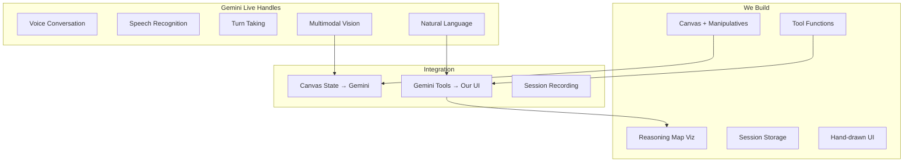

# Product Requirements Document
# Simili Math Tutor - Reasoning Visualization Platform

**Version:** 3.0  
**Date:** January 2025  
**Status:** Development Ready  
**Architecture:** Gemini Live 2.0 Multimodal  
**Design System:** Hand-drawn UI (rough.js)

---

## 1. Executive Summary

### 1.1 Product Vision
Simili is a reasoning visualization platform that makes student mathematical thinking visible. Using Gemini Live's multimodal conversational AI as the tutoring layer, we focus on capturing, structuring, and visualizing the student's problem-solving journey through an engaging, hand-drawn interface that feels approachable and mistake-friendly. We will accomplish this by guiding students through a structured, voice-first Three-Act Math framework, turning a passive canvas into a dynamic stage for their reasoning.

### 1.2 Core Innovation
**What We Build:** The reasoning map visualization system, hand-drawn manipulatives, and domain-specific mathematical tools.  
**What Gemini Provides:** All voice interaction, conversation flow, multimodal understanding, and natural tutoring behavior.

### 1.3 Design Philosophy
**Mistake-Friendly Math Environment**
Using rough.js and modern kid-centric design to:
- **Reduce math anxiety**: Sketchy UI feels like doodling, not formal testing
- **Celebrate mistakes**: Errors trigger growth animations, not red X's
- **Match natural learning**: Messy exploration is explicitly encouraged
- **Create warmth**: Bright colors, emojis, and playful interactions
- **Build confidence**: "Try again!" not "Wrong!" messaging
- **Feel modern**: Gradients, rounded corners, micro-interactions kids expect from apps

**Core Principles:**
1. **No harsh reds**: Orange/coral for "let's try another way" 🤷‍♀️
2. **Emoji integration**: Every feedback state has personality 🎉
3. **Growth mindset language**: "Interesting thinking!" vs "Incorrect"
4. **Energy over calm**: Kids want excitement, not sterile minimalism
5. **Familiar patterns**: Streaks, badges, progress bars from games they love

### 1.4 Success Criteria
- Students engage in mathematical discourse for >45 seconds per problem
- 70% of students attempt multiple solution strategies
- Reasoning maps accurately capture student thinking journey
- Teachers report improved visibility into student understanding

---

## 2. Technical Architecture

### 2.1 System Overview


```mermaid
graph TB
    subgraph "Gemini Live Handles"
        A[Voice Conversation]
        B[Speech Recognition]
        C[Turn Taking]
        D[Multimodal Vision]
        E[Natural Language]
    end
    
    subgraph "We Build"
        F[Canvas + Manipulatives]
        G[Reasoning Map Viz]
        H[Tool Functions]
        I[Session Storage]
        J[Hand-drawn UI]
    end
    
    subgraph "Integration"
        K[Canvas State → Gemini]
        L[Gemini Tools → Our UI]
        M[Session Recording]
    end
    
    D --> K
    E --> L
    F --> K
    H --> L
    L --> G
```

### 2.2 Gemini Live Configuration

```typescript
// Gemini Live Setup
const geminiConfig = {
  model: "gemini-2.5-flash-preview-native-audio-dialog",
  voice: {
    style: "friendly_patient",
    speed: 0.95, // Slightly slower for kids
    pitch: 1.1   // Slightly higher, warmer
  },
  
  systemInstruction: `
    You are Pi, a friendly math tutor for elementary students.
    
    PERSONALITY:
    - Warm, patient, encouraging
    - Celebrate mistakes as learning opportunities
    - Use grade-appropriate language
    - Never give direct answers, only Socratic guidance
    
    BEHAVIOR:
    - When student explains reasoning, call mark_reasoning_step
    - When detecting misconception, call flag_misconception
    - When student is stuck for 30s, call suggest_hint
    - When student erases repeatedly, call celebrate_exploration
    
    CRITICAL: Let students think. Don't interrupt productive struggle.
    Only intervene when truly stuck or explicitly asked for help.
  `,
  
  tools: [
    {
      name: "mark_reasoning_step",
      description: "Record a step in student's reasoning",
      parameters: {
        transcript: "string",
        classification: "correct | partial | incorrect | exploring",
        concepts: "string[]",
        confidence: "number"
      }
    },
    {
      name: "flag_misconception", 
      description: "Identify a mathematical misconception",
      parameters: {
        type: "unequal_parts | counting_not_measuring | whole_unclear",
        evidence: "string",
        severity: "minor | major"
      }
    },
    {
      name: "suggest_hint",
      description: "Provide scaffolded support", 
      parameters: {
        level: "encouragement | question | visual_hint | worked_example",
        content: "string"
      }
    },
    {
      name: "celebrate_exploration",
      description: "Acknowledge productive struggle",
      parameters: {
        message: "string",
        animation: "sparkle | grow | bounce"
      }
    },
    {
      name: "annotate_canvas",
      description: "Draw on student's canvas to guide attention",
      parameters: {
        type: "arrow | circle | underline",
        targetElementId: "string", // e.g., "fraction-bar-1", "pizza-1-slice-3"
        message: "string"
      }
    },
    {
      name: "set_lesson_act",
      description: "Transition the UI to the next act in the 3-act flow",
      parameters: {
        act: "'act1' | 'act2' | 'act3'",
        toolsToUnlock: "string[]" // e.g., ['fraction_bar', 'pen']
      }
    }
  ]
}
```

### 2.3 Hand-Drawn UI System

```typescript
// Element ID System for Canvas Annotations
// All interactive elements receive unique IDs for Gemini to target
const elementIdSystem = {
  // Pattern: {type}-{instance}-{subpart}
  manipulatives: {
    fractionBar: "fraction-bar-{id}",           // e.g., "fraction-bar-1"
    pizza: "pizza-{id}",                        // e.g., "pizza-1"
    pizzaSlice: "pizza-{id}-slice-{index}",     // e.g., "pizza-1-slice-3"
    numberLine: "number-line-{id}",             // e.g., "number-line-1"
    numberLinePoint: "number-line-{id}-point-{value}" // e.g., "number-line-1-point-0.5"
  },
  
  canvasElements: {
    studentDrawing: "drawing-{timestamp}",       // e.g., "drawing-1234567890"
    studentText: "text-{timestamp}",            // e.g., "text-1234567890"
  },
  
  // Elements are registered when created
  registerElement: (element, id) => {
    element.setAttribute('data-element-id', id)
    elementRegistry.set(id, element)
  }
}

// rough.js Configuration for Warm, Approachable UI
import rough from 'roughjs/bundled/rough.esm.js'

const uiConfig = {
  roughness: 1.5,        // Hand-drawn feel
  bowing: 1,             // Slight curve to lines
  strokeWidth: 2,        // Chunky, kid-friendly
  fillStyle: 'hachure',  // Sketchy fill
  fillWeight: 1,
  hachureAngle: -41,     // Consistent sketch angle
  hachureGap: 4,
  
  colors: {
    primary: '#4F46E5',      // Indigo
    correct: '#10B981',      // Green
    incorrect: '#F59E0B',    // Amber (not red!)
    exploring: '#8B5CF6',    // Purple
    background: '#FFFEF7',   // Warm paper
    ink: '#1F2937'          // Soft black
  }
}

// Components with hand-drawn aesthetic
const HandDrawnComponents = {
  // Main canvas component with three act modes
  UnifiedCanvas: ({ act, children }) => {
    const canvasMode = {
      act1: 'spotlight',    // Dimmed with central focus
      act2: 'workbench',    // Full tools and manipulatives
      act3: 'showcase'      // Clean display of final work
    }[act]
    
    return (
      <div className={`unified-canvas ${canvasMode}-mode`}>
        <Canvas 
          dimmed={act === 'act1'}
          toolsVisible={act === 'act2'}
          showcaseMode={act === 'act3'}
        />
        {children}
      </div>
    )
  },
  
  // Pi character component with voice state
  PiCharacter: ({ isListening, isSpeaking }) => {
    const rc = rough.svg(svg)
    // Animated circle character
    const piCircle = rc.circle(cx, cy, radius, {
      fill: colors.primary,
      fillStyle: 'solid',
      roughness: isListening ? 1.8 : 1.2,
      bowing: isSpeaking ? 2 : 1
    })
    
    // Pulsing animation when active
    if (isListening || isSpeaking) {
      piCircle.animate({
        scale: [1, 1.1, 1],
        duration: 1000
      })
    }
    
    return piCircle
  },
  
  // Voice input component with visual feedback
  VoiceInput: ({ isActive, onTranscript }) => {
    return (
      <div className="voice-input">
        <AudioWaveform active={isActive} />
        <TranscriptDisplay />
      </div>
    )
  },
  
  // Reasoning step bubbles
  ReasoningBubble: ({ step, classification }) => {
    const rc = rough.svg(svg)
    return rc.rectangle(x, y, width, height, {
      fill: colors[classification],
      fillStyle: 'solid',
      roughness: 1.5,
      bowing: 2
    })
  },
  
  // Math manipulatives with unique IDs
  FractionBar: ({ id, parts, filled }) => {
    const rc = rough.canvas(canvas)
    // Main rectangle with data-element-id for annotation targeting
    const bar = rc.rectangle(x, y, width, height, {
      roughness: 1.2,
      fill: 'transparent'
    })
    bar.setAttribute('data-element-id', `fraction-bar-${id}`)
    
    // Dividing lines (wonky on purpose)
    for (let i = 1; i < parts; i++) {
      rc.line(
        x + (width/parts * i), 
        y - 2, 
        x + (width/parts * i), 
        y + height + 2,
        { roughness: 1.5, bowing: 0.5 }
      )
    }
    
    return bar
  },
  
  // Pizza visual with identifiable slices
  Pizza: ({ id, slices = 8 }) => {
    const rc = rough.canvas(canvas)
    // Rough circle for pizza
    const pizza = rc.circle(cx, cy, diameter, {
      fill: '#FFA500',
      fillStyle: 'solid',
      roughness: 1.8
    })
    pizza.setAttribute('data-element-id', `pizza-${id}`)
    
    // Each slice gets an ID for annotation
    for (let i = 0; i < slices; i++) {
      const slice = drawSlice(i, slices)
      slice.setAttribute('data-element-id', `pizza-${id}-slice-${i}`)
    }
    
    // Pepperoni with hand-drawn circles
    pepperoniPositions.forEach(pos => {
      rc.circle(pos.x, pos.y, 20, {
        fill: '#8B0000',
        fillStyle: 'solid',
        roughness: 1
      })
    })
    
    return pizza
  }
}
```

---

3. The Three-Act User Experience
The core learning experience in Simili is structured around a dynamic, three-act flow that is orchestrated by the AI tutor. The UI transforms at each stage to support the pedagogical goal.

3.1 Act 1: The Spotlight (Wondering)
The goal is to spark curiosity and elicit a verbal plan. The UnifiedCanvas is in "Spotlight" mode.

UI State: The canvas is dimmed, with a single visual hook in the center. No tools or manipulatives are visible.

Interaction: The PiCharacter delivers the "Notice & Wonder" prompt. The system uses VoiceInput to listen. The set_lesson_act tool has not been called yet.

3.2 Act 2: The Workbench (Solving)
The goal is to explore, manipulate, and solve. The AI calls set_lesson_act({ act: 'act2', toolsToUnlock: [...] }) to trigger this state.

UI State: The UI animates into "Workbench" mode. The visual hook moves to a corner for reference. The specific, relevant manipulatives (e.g., FractionBar, NumberLine) and basic tools appear on the canvas.

Interaction: The student uses their voice and the unlocked tools to solve the problem. Gemini Vision receives canvas state updates. The AI uses the annotate_canvas tool (with targetElementId) to provide guidance by drawing directly on the canvas.

3.3 Act 3: The Showcase (Synthesizing)
The goal is to reflect on and solidify the learning. The AI calls set_lesson_act({ act: 'act3' }) to trigger this state.

UI State: The canvas clears to "Showcase" the student's final work. All tools disappear.

Interaction: PiCharacter guides the student to explain their solution. It introduces formal vocabulary, and the student re-explains their learning.

## 4. Development Phases

### 4.1 Phase v0: Core Loop with Three-Act Structure (3 weeks)

#### Week 1: Foundation + Act 1 (The Spotlight)
```typescript
Sprint 0.1: Core Setup + Act 1
□ Next.js project with TypeScript
□ Gemini Live 2.0 integration with system prompt
□ rough.js setup for hand-drawn UI components
□ Implement state management for three acts (Zustand)
□ Build UnifiedCanvas component with "Spotlight" mode
□ PiCharacter component with voice introduction
□ VoiceInput component for student responses
□ Single pizza fraction problem setup

Deliverable: Functional Act 1 - "Notice & Wonder" conversation
Test: Students can verbally explore the problem, UI dimmed appropriately
```

#### Week 2: Act 2 (The Workbench) + Multimodal
```typescript
Sprint 0.2: Act 2 + Canvas Integration
□ Implement set_lesson_act tool function
□ Build "Workbench" mode for UnifiedCanvas
□ tldraw canvas with rough.js rendering
□ Dynamic tool unlocking (fraction bar, pizza visual)
□ Canvas element ID system for annotations
□ Send canvas snapshots to Gemini Vision
□ Implement annotate_canvas with targetElementId
□ Basic reasoning step capture via tool calls

Deliverable: Functional Act 2 with voice-unlocked tools
Test: Gemini can see canvas, tools appear on command
```

#### Week 3: Act 3 (The Showcase) + Reasoning Map
```typescript
Sprint 0.3: Act 3 + Visualization
□ Build "Showcase" mode for UnifiedCanvas
□ Implement Act 3 transition (clear tools, highlight work)
□ Reasoning map with hand-drawn bubbles
□ Connect all Gemini tool calls to map visualization
□ Step classification with growth mindset visuals
□ Mistake celebration animations
□ Session recording with act transitions
□ Basic replay showing three-act journey

Deliverable: Complete three-act problem with reasoning map
Test: 5 students complete full journey, map captures all acts
```

### 4.2 Phase v1: Enhanced Intelligence (4 weeks)

#### Week 4-5: Problem Variety & Progression
```typescript
Sprint 1.1: Content Expansion
□ 5 problems for Grade 3 fractions unit
□ Problem progression logic
□ More manipulatives (number line, arrays)
□ Hand-drawn problem illustrations
□ Session persistence across problems

Deliverable: Complete fraction unit
Test: Students progress through 3+ problems
```

#### Week 6-7: Advanced Reasoning Features
```typescript
Sprint 1.2: Reasoning Enhancement
□ Branching visualization for strategies
□ Concept tagging and clustering
□ Misconception pattern detection
□ Enhanced replay with audio sync
□ Export reasoning map as image

Deliverable: Rich reasoning visualization
Test: Teachers understand student thinking from map
```

### 4.3 Phase v2: Teacher Tools (4 weeks)

#### Week 8-11: Teacher Dashboard
```typescript
Sprint 2.1: Teacher Features
□ Class overview of reasoning maps
□ Common misconception identification
□ Student grouping suggestions
□ Progress tracking
□ Parent report generation

Deliverable: Teacher dashboard
Test: Teachers can identify intervention needs
```

---

## 5. Technical Stack

```yaml
Frontend:
  Framework: Next.js 14 (App Router)
  Language: TypeScript 5.x
  Canvas: tldraw 2.x
  Hand-drawn UI: rough.js 4.x
  Animation: Framer Motion
  State: Zustand
  Styling: Tailwind CSS + Custom rough.js components

AI/ML:
  Conversational AI: Gemini Live 2.0
  Vision: Gemini Multimodal
  Tools: Custom TypeScript functions
  
Backend:
  Database: Supabase (PostgreSQL)
  Storage: Cloudflare R2
  Hosting: Vercel
  
Development:
  Testing: Vitest + Playwright
  CI/CD: GitHub Actions
```

---

## 6. UI/UX Design System

### 6.1 Hand-Drawn Component Library

```typescript
// Design tokens for rough.js
const designSystem = {
  // Roughness levels
  roughness: {
    subtle: 0.5,    // Nearly straight
    normal: 1.5,    // Clearly hand-drawn
    playful: 2.5    // Very sketchy
  },
  
  // Color palette (vibrant, kid-friendly like modern apps)
  colors: {
    paper: '#FFFEF7',        // Warm white
    ink: '#2D3748',          // Soft black
    primary: '#FF6B6B',      // Coral (warm, energetic)
    secondary: '#4ECDC4',    // Teal (fresh, friendly)
    success: '#32D74B',      // iOS Green (celebrate-y)
    warning: '#FF9500',      // iOS Orange (encouraging)
    error: '#FF6B6B',        // Coral (mistake-friendly, not harsh red)
    
    // Topic-specific accent colors for variety
    accents: {
      fractions: '#FF6B6B',  // Coral
      geometry: '#FF9500',   // Orange  
      numbers: '#4ECDC4',    // Teal
      patterns: '#A78BFA'    // Purple
    },
    
    // Gradient backgrounds (kids love depth)
    gradients: {
      primary: 'linear-gradient(135deg, #FF6B6B 0%, #FF8E8E 100%)',
      secondary: 'linear-gradient(135deg, #4ECDC4 0%, #6EE7DB 100%)',
      success: 'linear-gradient(135deg, #32D74B 0%, #5DE26B 100%)'
    },
    
    // Pastel fills for bubbles (brighter, more energy)
    fills: {
      correct: '#D1FAE5',    // Light green
      partial: '#FFF3CD',    // Light yellow (warmer)
      incorrect: '#FFE4E1',  // Light coral (not orange - friendlier)
      exploring: '#E0E7FF'   // Light blue (curiosity color)
    }
  },
  
  // Typography (modern, kid-friendly fonts)
  typography: {
    // Replace Inter with rounder, friendlier options
    body: '"Fredoka", "Quicksand", -apple-system, BlinkMacSystemFont, "Segoe UI", sans-serif',
    handwritten: '"Fredoka", "Nunito", "Poppins", -apple-system, sans-serif',
    
    // Font weights that feel approachable
    weights: {
      normal: 400,
      medium: 500,  // Avoid heavy weights - too serious
      bold: 600     // Not 700+ which feels "school-y"
    },
    
    // Emoji integration guidelines
    emojis: {
      success: '🎉 ✨ 🌟 🎊',
      thinking: '🤔 💭 🧠',
      progress: '🚀 ⭐ 🎯',
      mistake: '🤷‍♀️ 💡 🌱', // Growth mindset emojis
      celebration: '🎉 🎊 ✨ 🌟 🎈'
    }
  },

  // Animation presets (more energetic, kid-friendly)
  animations: {
    drawIn: {
      strokeDasharray: 1000,
      strokeDashoffset: [1000, 0],
      duration: 1000,
      easing: 'cubic-bezier(0.68, -0.55, 0.265, 1.55)' // Bounce
    },
    pulse: {
      scale: [1, 1.08, 1], // Slightly more dramatic
      duration: 500
    },
    celebrate: {
      // More energetic celebration
      rotate: [-8, 8, -5, 5, 0],
      scale: [1, 1.15, 1.05, 1.1, 1],
      duration: 600
    },
    // New: particle celebration for big wins
    confetti: {
      particles: 20,
      colors: ['#FF6B6B', '#4ECDC4', '#32D74B', '#FF9500'],
      duration: 2000,
      spread: 180
    },
    // New: gentle wiggle for "let's try again" 
    encourageRetry: {
      rotate: [-2, 2, -1, 1, 0],
      duration: 400,
      easing: 'ease-out'
    }
  },

  // Modern interaction patterns kids expect from apps
  interactions: {
    // Gestures (mobile-first)
    gestures: {
      swipeToNext: true,
      pinchToZoom: true,
      tapToSelect: true,
      longPressForHints: true
    },
    
    // Gamification elements
    gamification: {
      streakCounters: true,
      achievementBadges: true,
      progressBars: 'juice-fill', // Fills like liquid
      levelProgression: true,
      collectibles: 'math-gems'
    },
    
    // Feedback patterns
    feedback: {
      haptics: true,           // iPhone-style vibration
      soundEffects: 'minimal', // Soft pops and chimes
      microInteractions: true, // Buttons that squish when pressed
      loadingStates: 'playful' // Dancing dots, not spinners
    },
    
    // Modern app features kids expect
    modernFeatures: {
      darkMode: true,          // Surprisingly popular with 10+
      avatarSystem: 'geometric', // Simple character customization  
      onboardingTooltips: true,
      swipeNavigation: true,
      pullToRefresh: true
    }
  }
}
```

### 6.2 Mistake-Friendly UI Guidelines

```typescript
// UI language that celebrates learning over correctness
const uiCopy = {
  errorStates: {
    // Instead of "Wrong!" or "Incorrect"
    encouraging: [
      "Hmm, let's think about this together! 🤔",
      "Interesting approach! What if we tried...? 💡",
      "Almost there! One more adjustment? 🌱", 
      "I love how you're thinking! Let's explore this more 🚀"
    ]
  },
  
  progressMessages: {
    // Growth mindset throughout
    exploring: "You're being such a math detective! 🔍",
    struggling: "This is your brain growing stronger! 💪",
    breakthrough: "YES! You figured that out! 🎉",
    reflection: "Tell me more about your thinking... 🤓"
  },
  
  // Replace technical terms with kid language
  mathLanguage: {
    'algorithm': 'your method',
    'solution': 'answer',
    'incorrect': 'not quite yet',
    'revision': 'another try',
    'strategy': 'your way of solving it'
  }
}

// Visual error handling - no harsh red warnings
const mistakeFriendlyUI = {
  errorColor: '#FF9500',    // Warm orange, not red
  errorIcon: '🤷‍♀️',          // Shrug, not X
  errorAnimation: 'gentleBounce', // Not harsh shake
  followUpAction: 'suggestHint',  // Always offer help
  celebrateAttempt: true,    // Acknowledge effort even if wrong
  
  // Progressive disclosure - don't overwhelm
  hintLevels: [
    'encouragement',   // "You're thinking hard!"
    'question',        // "What if we looked at this part?"
    'visualHint',      // Highlight relevant area
    'workedExample'    // Show similar problem
  ]
}
```

### 6.3 Component Examples

```typescript
// Hand-drawn button
const SketchyButton = ({ children, onClick }) => {
  const [isHovered, setIsHovered] = useState(false)
  
  return (
    <button
      onMouseEnter={() => setIsHovered(true)}
      onMouseLeave={() => setIsHovered(false)}
      onClick={onClick}
      className="relative"
    >
      <svg>
        {rough.rectangle(0, 0, width, height, {
          fill: isHovered ? colors.primary : 'transparent',
          fillStyle: isHovered ? 'solid' : 'hachure',
          roughness: 1.5,
          bowing: isHovered ? 2 : 1
        })}
      </svg>
      <span className="absolute inset-0 flex items-center justify-center">
        {children}
      </span>
    </button>
  )
}

// Hand-drawn progress indicator
const SketchyProgress = ({ steps, current }) => {
  return (
    <svg>
      {steps.map((step, i) => {
        const isComplete = i < current
        const isCurrent = i === current
        
        return rough.circle(x + i * spacing, y, radius, {
          fill: isComplete ? colors.success : 'transparent',
          fillStyle: isComplete ? 'solid' : 'hachure',
          roughness: isCurrent ? 2 : 1,
          strokeWidth: isCurrent ? 3 : 2
        })
      })}
    </svg>
  )
}
```

---

## 7. Implementation Details

### 7.1 Tool Functions for Gemini

```typescript
// These are called by Gemini Live during conversation
const toolImplementations = {
  mark_reasoning_step: async (params) => {
    // Add to reasoning map
    const step = {
      id: generateId(),
      timestamp: Date.now(),
      transcript: params.transcript,
      classification: params.classification,
      concepts: params.concepts,
      confidence: params.confidence
    }
    
    // Update UI with hand-drawn bubble
    reasoningMap.addStep(step)
    
    // Animate appearance
    animateStepAppearance(step)
    
    // Store in session
    session.addReasoningStep(step)
    
    return { success: true }
  },
  
  flag_misconception: async (params) => {
    // Highlight misconception visually
    const visual = createMisconceptionVisual(params)
    
    // Don't show as "error" - show as "interesting thinking"
    reasoningMap.addAnnotation({
      type: 'misconception',
      visual: visual,
      celebration: true  // Celebrate the attempt!
    })
    
    return { success: true }
  },
  
  suggest_hint: async (params) => {
    // Visual hint appears on canvas
    if (params.level === 'visual_hint') {
      canvas.addPiAnnotation({
        type: params.hintType,
        coordinates: params.coordinates,
        style: 'hand-drawn',
        color: colors.primary
      })
    }
    
    return { success: true }
  },
  
  celebrate_exploration: async (params) => {
    // Trigger celebration animation
    const animation = celebrations[params.animation]
    reasoningMap.celebrate(animation)
    
    // Add encouragement to transcript
    transcript.addEncouragement(params.message)
    
    return { success: true }
  }
}
```

### 7.2 Session Data Model

```typescript
interface Session {
  id: string
  studentId: string
  problemId: string
  startTime: Date
  
  // Captured from Gemini tool calls
  reasoningSteps: ReasoningStep[]
  misconceptions: Misconception[]
  strategies: Strategy[]
  
  // Canvas history
  canvasEvents: CanvasEvent[]
  
  // Conversation (optional storage)
  transcript: Message[]
  audioUrl?: string  // If we store audio
  
  // Computed metrics
  metrics: {
    talkTime: number
    stepsCount: number
    strategiesAttempted: number
    misconceptionsCorrected: number
    completionStatus: 'solved' | 'attempted' | 'abandoned'
  }
}
```

---

## 8. Testing Strategy

### 8.1 v0 Testing (Week 3)
```typescript
// Test with 5 students
const v0Tests = {
  setup: "Single pizza problem, 5 third-graders",
  
  measurements: {
    engagement: "Do students talk for >30 seconds?",
    reasoning: "Are 80% of steps correctly classified?",
    ui: "Do students understand hand-drawn elements?",
    gemini: "Does Pi respond appropriately?"
  },
  
  success_criteria: {
    completion: "5/5 students complete problem",
    reasoning_capture: "Average 5+ steps per student",
    no_anxiety: "No students express frustration with UI",
    technical: "Zero Gemini Live disconnections"
  }
}
```

### 8.2 v1 Testing (Week 7)
```typescript
const v1Tests = {
  setup: "Full fractions unit, 20 students",
  
  measurements: {
    progression: "Can students complete 3+ problems?",
    strategies: "Do 60% try multiple approaches?",
    misconceptions: "Are common errors identified?",
    replay: "Can teachers understand from replay?"
  }
}
```

---

## 9. Risk Mitigation

| Risk | Mitigation |
|------|------------|
| Gemini Live API costs | Implement caching, batch tool calls |
| Hand-drawn UI performance | Pre-render common shapes, use CSS where possible |
| Kids don't like sketchy look | A/B test roughness levels |
| Canvas state too large | Compress, send diffs only |

---

## 10. Success Metrics

### Core KPIs
- **Engagement**: Students talk for >45 seconds per problem
- **Reasoning**: Average 6+ reasoning steps captured per problem
- **Strategies**: 70% of students try multiple approaches
- **Completion**: 80% problem completion rate
- **Teacher Value**: 4.5/5 teacher satisfaction score


